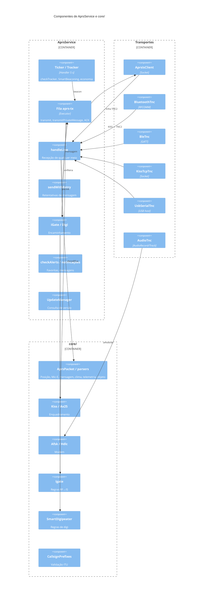

# C4 — Nível 3: Componentes do serviço e do núcleo

```mermaid
C4Component
    title Componentes de AprsService e core/
    Container_Boundary(svc, "AprsService") {
        Component(tick, "Ticker / Tracker", "Handler 5 s", "checkTracker, SmartBeaconing, economia")
        Component(tx, "Fila aprs-tx", "Executor", "transmit, transmitPrivateMessage, ACK")
        Component(rx, "handleLine", "", "Recepção de qualquer meio")
        Component(retry, "sendWithRetry", "", "Retentativas de mensagem")
        Component(gw, "iGate / Digi", "", "Encaminhamento")
        Component(alerts, "checkAlerts / notificações", "", "Favoritas, mensagens")
        Component(upd, "UpdateManager", "", "Consulta de versão")
    }
    Container_Boundary(tr, "Transportes") {
        Component(isc, "AprsIsClient", "Socket")
        Component(bt, "BluetoothTnc", "RFCOMM")
        Component(ble, "BleTnc", "GATT")
        Component(tcp, "KissTcpTnc", "Socket")
        Component(usb, "UsbSerialTnc", "USB host")
        Component(aud, "AudioTnc", "AudioRecord/Track")
    }
    Container_Boundary(core, "core/") {
        Component(parse, "AprsPacket / parsers", "", "Posição, Mic-E, mensagem, clima, telemetria, objeto")
        Component(kiss, "Kiss / Ax25", "", "Enquadramento")
        Component(afsk, "Afsk / Hdlc", "", "Modem")
        Component(igl, "Igate", "", "Regras RF↔IS")
        Component(digi, "SmartDigipeater", "", "Regras de digi")
        Component(call, "CallsignPrefixes", "", "Validação ITU")
    }
    Rel(isc, rx, "linha TNC2")
    Rel(bt, rx, "KISS → TNC2")
    Rel(ble, rx, "")
    Rel(tcp, rx, "")
    Rel(usb, rx, "")
    Rel(aud, afsk, "amostras")
    Rel(rx, parse, "decodifica")
    Rel(rx, gw, "pacote")
    Rel(gw, igl, "")
    Rel(gw, digi, "")
    Rel(gw, tx, "enfileira")
    Rel(tick, tx, "beacon")
    Rel(retry, tx, "mensagem")
    Rel(tx, isc, "")
    Rel(tx, kiss, "")
```
