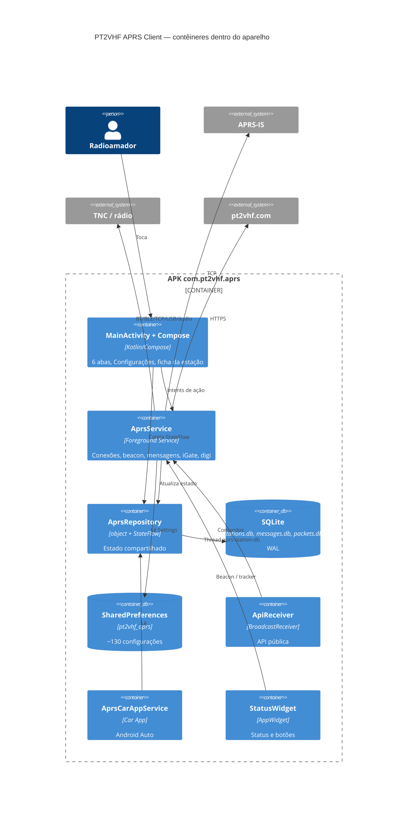

# C4 — Nível 2: Contêineres

```mermaid
C4Container
    title PT2VHF APRS Client — contêineres dentro do aparelho
    Person(op, "Radioamador")
    Container_Boundary(apk, "APK com.pt2vhf.aprs") {
        Container(ui, "MainActivity + Compose", "Kotlin/Compose", "6 abas, Configurações, ficha da estação")
        Container(svc, "AprsService", "Foreground Service", "Conexões, beacon, mensagens, iGate, digi")
        Container(repo, "AprsRepository", "object + StateFlow", "Estado compartilhado")
        ContainerDb(db, "SQLite", "stations.db, messages.db, packets.db", "WAL")
        ContainerDb(prefs, "SharedPreferences", "pt2vhf_aprs", "~130 configurações")
        Container(api, "ApiReceiver", "BroadcastReceiver", "API pública")
        Container(car, "AprsCarAppService", "Car App", "Android Auto")
        Container(widget, "StatusWidget", "AppWidget", "Status e botões")
    }
    System_Ext(is, "APRS-IS")
    System_Ext(tnc, "TNC / rádio")
    System_Ext(site, "pt2vhf.com")
    Rel(op, ui, "Toca")
    Rel(ui, svc, "Intents de ação")
    Rel(ui, repo, "Coleta StateFlow")
    Rel(svc, repo, "Atualiza estado")
    Rel(repo, db, "Thread aprs-station-db")
    Rel(svc, prefs, "Lê Settings")
    Rel(svc, is, "TCP")
    Rel(svc, tnc, "BT/BLE/TCP/USB/áudio")
    Rel(svc, site, "HTTPS")
    Rel(api, svc, "Comandos")
    Rel(car, repo, "Lê")
    Rel(widget, svc, "Beacon / tracker")
```
