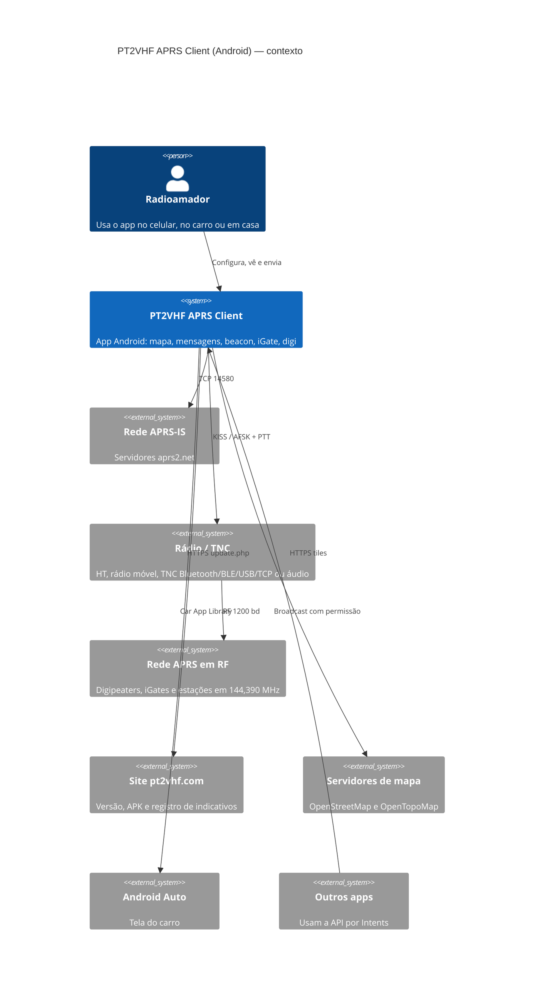

# C4 — Nível 1: Contexto

```mermaid
C4Context
    title PT2VHF APRS Client (Android) — contexto
    Person(op, "Radioamador", "Usa o app no celular, no carro ou em casa")
    System(app, "PT2VHF APRS Client", "App Android: mapa, mensagens, beacon, iGate, digi")
    System_Ext(is, "Rede APRS-IS", "Servidores aprs2.net")
    System_Ext(radio, "Rádio / TNC", "HT, rádio móvel, TNC Bluetooth/BLE/USB/TCP ou áudio")
    System_Ext(rf, "Rede APRS em RF", "Digipeaters, iGates e estações em 144,390 MHz")
    System_Ext(site, "Site pt2vhf.com", "Versão, APK e registro de indicativos")
    System_Ext(tiles, "Servidores de mapa", "OpenStreetMap e OpenTopoMap")
    System_Ext(auto, "Android Auto", "Tela do carro")
    System_Ext(apps, "Outros apps", "Usam a API por Intents")
    Rel(op, app, "Configura, vê e envia")
    Rel(app, is, "TCP 14580")
    Rel(app, radio, "KISS / AFSK + PTT")
    Rel(radio, rf, "RF 1200 bd")
    Rel(app, site, "HTTPS update.php")
    Rel(app, tiles, "HTTPS tiles")
    Rel(app, auto, "Car App Library")
    Rel(apps, app, "Broadcast com permissão")
```
