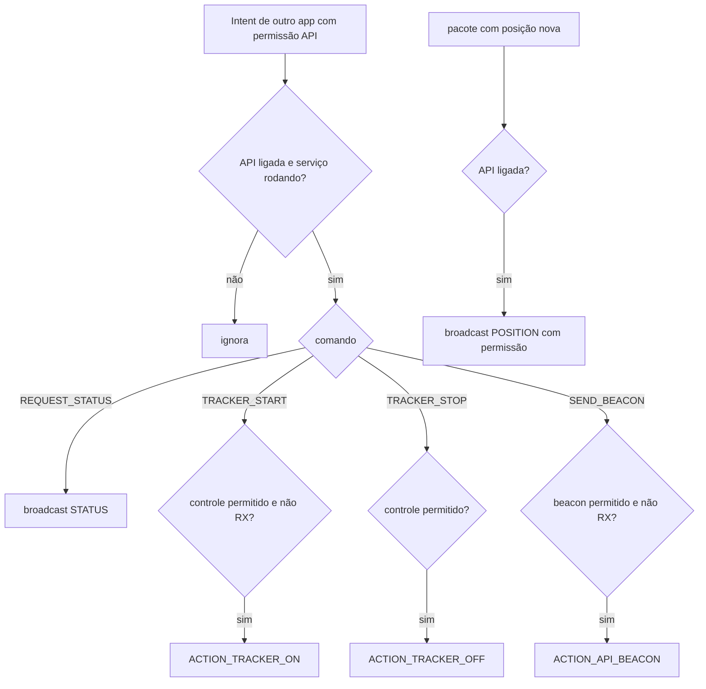

# Fluxograma — api-externa

> Arqueólogo, 2026-11-27. 🟢 `service/ApiReceiver.kt`, `service/AprsService.kt:1127-1157`.

```mermaid
flowchart TD
    A[Intent de outro app com permissão API] --> B{API ligada e serviço rodando?}
    B -- não --> Z[ignora]
    B -- sim --> C{comando}
    C -- REQUEST_STATUS --> D[broadcast STATUS]
    C -- TRACKER_START --> E{controle permitido e não RX?}
    C -- TRACKER_STOP --> F{controle permitido?}
    C -- SEND_BEACON --> G{beacon permitido e não RX?}
    E -- sim --> H[ACTION_TRACKER_ON]
    F -- sim --> I[ACTION_TRACKER_OFF]
    G -- sim --> J[ACTION_API_BEACON]
    K[pacote com posição nova] --> L{API ligada?} -- sim --> M[broadcast POSITION com permissão]
```
