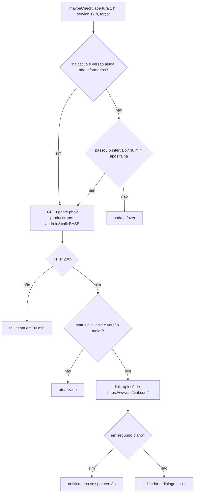

# Fluxograma — atualizacao-e-site

> Arqueólogo, 2026-11-27. 🟢 `data/UpdateManager.kt`, `data/UpdateCheck.kt`.

```mermaid
flowchart TD
    A[maybeCheck: abertura 1 h, serviço 12 h, forçar] --> B{"indicativo e versão ainda não informados?"}
    B -- sim --> D
    B -- não --> C{passou o intervalo? 30 min após falha}
    C -- não --> Z[nada a fazer]
    C -- sim --> D["GET update.php?product=aprs-android&call=BASE"]
    D --> E{HTTP 200?}
    E -- não --> F[fail, tenta em 30 min]
    E -- sim --> G{status available e versão maior?}
    G -- não --> H[atualizado]
    G -- sim --> I["link .apk só de https://www.pt2vhf.com/"]
    I --> J{em segundo plano?}
    J -- sim --> K[notifica uma vez por versão]
    J -- não --> L[indicador e diálogo na UI]
```
