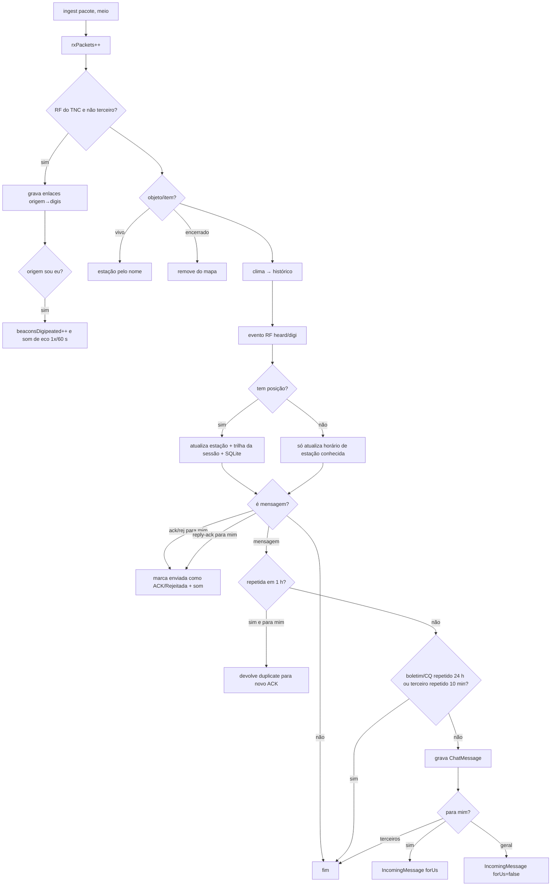

# Fluxograma — estado-e-persistencia

> Arqueólogo, 2026-11-27. 🟢 `data/AprsRepository.kt:493-631`.

```mermaid
flowchart TD
    A[ingest pacote, meio] --> B[rxPackets++]
    B --> C{RF do TNC e não terceiro?}
    C -- sim --> D[grava enlaces origem→digis]
    D --> E{origem sou eu?}
    E -- sim --> F[beaconsDigipeated++ e som de eco 1x/60 s]
    C --> G{objeto/item?}
    G -- vivo --> H[estação pelo nome]
    G -- encerrado --> I[remove do mapa]
    G --> J[clima → histórico]
    J --> K[evento RF heard/digi]
    K --> L{tem posição?}
    L -- sim --> M[atualiza estação + trilha da sessão + SQLite]
    L -- não --> N[só atualiza horário de estação conhecida]
    M --> O{é mensagem?}
    N --> O
    O -- não --> Z[fim]
    O -- ack/rej para mim --> P[marca enviada como ACK/Rejeitada + som]
    O -- reply-ack para mim --> P
    O -- mensagem --> Q{repetida em 1 h?}
    Q -- sim e para mim --> R[devolve duplicate para novo ACK]
    Q -- não --> S{boletim/CQ repetido 24 h ou terceiro repetido 10 min?}
    S -- sim --> Z
    S -- não --> T[grava ChatMessage]
    T --> U{para mim?}
    U -- sim --> V[IncomingMessage forUs]
    U -- geral --> W[IncomingMessage forUs=false]
    U -- terceiros --> Z
```
