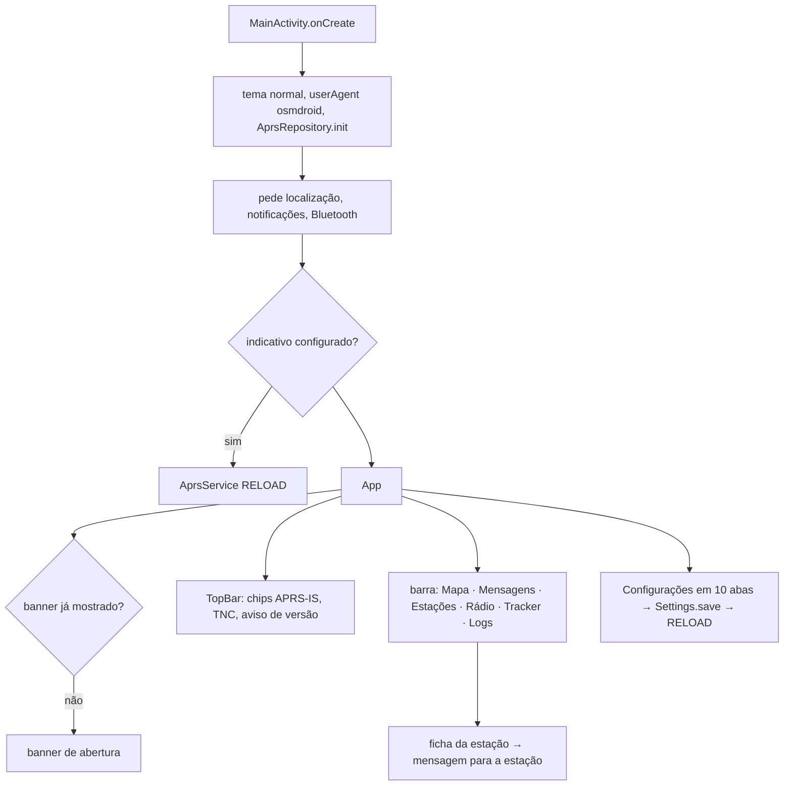

# Fluxograma — interface

> Arqueólogo, 2026-11-27. 🟢 `ui/App.kt`, `MainActivity.kt`.

```mermaid
flowchart TD
    A[MainActivity.onCreate] --> B[tema normal, userAgent osmdroid, AprsRepository.init]
    B --> C[pede localização, notificações, Bluetooth]
    C --> D{indicativo configurado?}
    D -- sim --> E[AprsService RELOAD]
    D --> F[App]
    F --> G{banner já mostrado?}
    G -- não --> H[banner de abertura]
    F --> I[TopBar: chips APRS-IS, TNC, aviso de versão]
    F --> J[barra: Mapa · Mensagens · Estações · Rádio · Tracker · Logs]
    J --> K[ficha da estação → mensagem para a estação]
    F --> L[Configurações em 10 abas → Settings.save → RELOAD]
```
