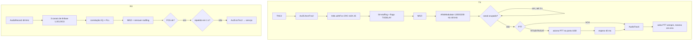

# Fluxograma — modem-e-radio

> Arqueólogo, 2026-11-27. 🟢 `core/Afsk.kt`, `core/RadioControl.kt`, `service/AudioTnc.kt`.

```mermaid
flowchart TD
    subgraph TX
        A[TNC2] --> B[Ax25.fromTnc2] --> C[Hdlc.withFcs CRC-16/X.25]
        C --> D[bit-stuffing + flags TXDELAY] --> E[NRZI] --> F[AfskModulator 1200/2200 Hz 48 kHz]
        F --> G{canal ocupado?}
        G -- sim, até 3 s --> G
        G -- não --> H{PTT}
        H -- VOX --> I[AudioTrack]
        H -- RTS/DTR/CAT --> J[aciona PTT na porta USB] --> K[espera 40 ms] --> I
        I --> L[solta PTT sempre, mesmo em erro]
    end
    subgraph RX
        M[AudioRecord 48 kHz] --> N[3 canais de ênfase 1,0/2,0/0,5]
        N --> O[correlação I/Q + PLL] --> P[NRZI + remover stuffing] --> Q{FCS ok?}
        Q -- sim --> R{repetido em 1 s?}
        R -- não --> S[Ax25.toTnc2 → serviço]
    end
```
