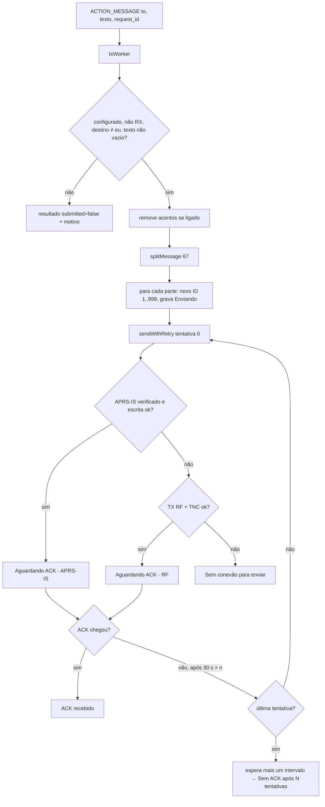
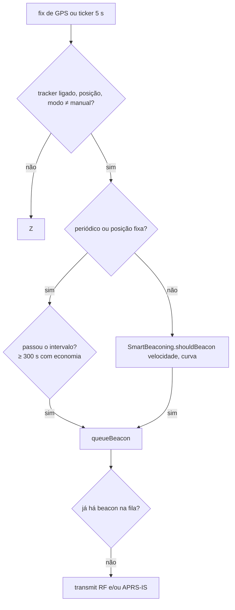

# Fluxograma — servico-e-transportes

> Arqueólogo, 2026-11-27. 🟢 `service/AprsService.kt`.

## Envio de mensagem privada

```mermaid
flowchart TD
    A[ACTION_MESSAGE to, texto, request_id] --> B[txWorker]
    B --> C{configurado, não RX, destino ≠ eu, texto não vazio?}
    C -- não --> R[resultado submitted=false + motivo]
    C -- sim --> D[remove acentos se ligado]
    D --> E[splitMessage 67]
    E --> F[para cada parte: novo ID 1..999, grava Enviando]
    F --> G[sendWithRetry tentativa 0]
    G --> H{APRS-IS verificado e escrita ok?}
    H -- sim --> I[Aguardando ACK · APRS-IS]
    H -- não --> J{TX RF + TNC ok?}
    J -- sim --> K[Aguardando ACK · RF]
    J -- não --> L[Sem conexão para enviar]
    I --> M{ACK chegou?}
    K --> M
    M -- sim --> N[ACK recebido]
    M -- não, após 30 s × n --> O{última tentativa?}
    O -- não --> G
    O -- sim --> P[espera mais um intervalo → Sem ACK após N tentativas]
```

## Tracker

```mermaid
flowchart TD
    A[fix de GPS ou ticker 5 s] --> B{tracker ligado, posição, modo ≠ manual?}
    B -- não --> Z
    B -- sim --> C{periódico ou posição fixa?}
    C -- sim --> D{passou o intervalo?<br/>≥ 300 s com economia}
    C -- não --> E[SmartBeaconing.shouldBeacon velocidade, curva]
    D -- sim --> F[queueBeacon]
    E -- sim --> F
    F --> G{já há beacon na fila?}
    G -- não --> H[transmit RF e/ou APRS-IS]
```
